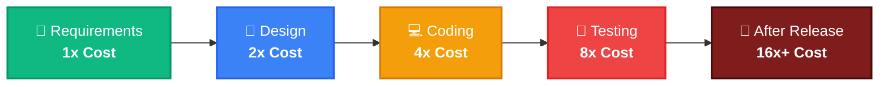
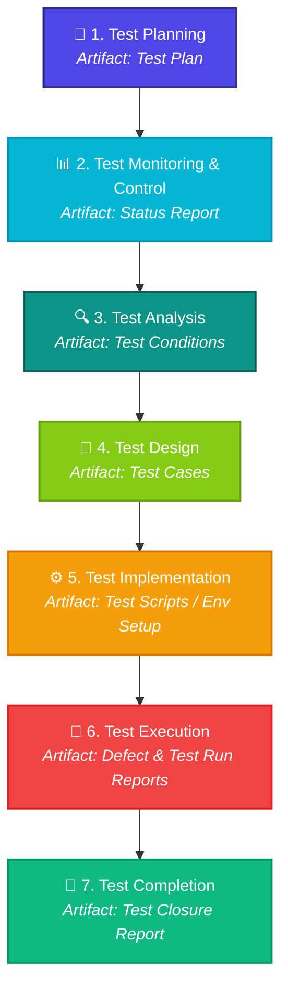

# 🎓 FPT UNIVERSITY — DANANG CAMPUS
## 🧪 SWT301 — Software Testing
### 📝 LAB 1: Testing Fundamentals through Effective Prompts

<div align="center">

[](https://dn.fpt.edu.vn/)
[](#)
[](#)

---

### 👤 Student Profile
| Field | Information |
| :--- | :--- |
| **Full Name** | **Nguyễn Văn Dạng** |
| **Student ID & Class** | **DE190324** / **SE20A02** |
| **AI Assistants Used** | 🤖 ChatGPT & 🐙 GitHub Copilot |

---

</div>

## 📌 Table of Contents
- [📖 Overview](#-overview)
- [🎯 Nhiệm vụ 1: Why is Testing Necessary?](#-nhiệm-vụ-1-why-is-testing-necessary)
  - [Prompt Engineering](#prompt-engineering)
  - [Concept Breakdown (Error, Defect, Failure, Root Cause)](#concept-breakdown)
  - [Cost of Late Testing](#cost-of-late-testing)
  - [Nhận xét cá nhân (Personal Reflection)](#nhận-xét-cá-nhân)
- [🔍 Nhiệm vụ 2: What is Testing?](#-nhiệm-vụ-2-what-is-testing)
  - [Zero-shot vs Few-shot Comparisons](#zero-shot-vs-few-shot-comparisons)
  - [Testing vs Debugging](#testing-vs-debugging)
  - [Verification vs Validation](#verification-vs-validation)
- [💡 Nhiệm vụ 3: 7 Testing Principles](#-nhiệm-vụ-3-7-testing-principles)
- [⚙️ Nhiệm vụ 4: Test Activities & Roles](#-nhiệm-vụ-4-test-activities--roles)
  - [7 ISTQB Testing Activities Flowchart](#7-istqb-testing-activities-flowchart)
  - [Roles & Responsibilities](#roles--responsibilities)
- [🛠️ Nhiệm vụ 5: Essential Skills for Testers in 2026](#-nhiệm-vụ-5-essential-skills-for-testers-in-2026)
  - [Core Skills Checklist](#core-skills-checklist)
  - [Reflection](#reflection)
- [🎓 Kết luận](#-kết-luận)
- [📚 Tài liệu tham khảo](#-tài-liệu-tham-khảo)

---

## 📖 Overview
Lab 1 focuses on building a solid foundation in **Software Testing Fundamentals** through the practical application of **Prompt Engineering**. By crafting, evaluating, and refining prompts, we explore standard software testing concepts (ISTQB), comparative methodologies, testing principles, activities, and the evolving skill set required for a modern QA Engineer in 2026.

---

## 🎯 Nhiệm vụ 1: Why is Testing Necessary?

### Prompt Engineering
> [!NOTE]
> **System Prompt (ISTQB Persona & CinePlex Booking Context)**
> 
> *“You are an ISTQB-certified software testing expert with 10 years of experience.*  
> *Context: I am a second-year software engineering student studying testing fundamentals.*  
> *Task: Explain Error, Defect, Failure, and Root Cause using a movie booking application example. Also explain why late testing is expensive.*  
> *Format: Use a table with columns Concept | Definition | Example. Definitions must be under 30 words.*  
> *Example domain: CinePlex movie ticket booking system.”*

---

### Concept Breakdown

| Concept | Definition | CinePlex Example |
| :--- | :--- | :--- |
| **🔴 Error** | A human mistake (made by a developer, designer, or analyst) that creates incorrect results. | Developer misunderstands requirement rules regarding ticket pricing and discounts. |
| **🐛 Defect (Bug)** | A flaw in the software code or documentation caused by an error. | The discount calculation code contains an incorrect formula (e.g., subtracting fixed amount instead of %). |
| **💥 Failure** | The software behaves incorrectly and deviates from expected outcomes during execution. | A customer is charged 500,000 VND instead of 200,000 VND at check-out. |
| **🌱 Root Cause** | The fundamental, original reason that led to the creation of the defect. | The requirement specification document was ambiguous and unclear about promotion policies. |

#### 📊 Quick Summary Table
```
┌──────────────┐      ┌──────────────┐      ┌──────────────┐
│  Root Cause  │ ───> │    Error     │ ───> │    Defect    │ ───> 💥 Failure (User-facing)
└──────────────┘      └──────────────┘      └──────────────┘
```

---

### Cost of Late Testing
Finding and fixing bugs late in the software development lifecycle (SDLC) costs exponentially more. Below is the visualized multiplier of testing costs across phases:



> [!WARNING]
> Fixing a bug post-release (16x) is **16 times more expensive** than fixing it during the Requirements phase (1x) due to customer impact, rollbacks, and hotfix deployments.

---

### Nhận xét cá nhân
> [!TIP]
> **My Reflection:**
> AI provided a clear explanation with relevant examples. However, the first answer did not include the exact cost multiplier shown in the lecture slides. I refined the prompt to request software cost impact. After comparing with ISTQB slides, the final answer became more accurate.

---

## 🔍 Nhiệm vụ 2: What is Testing?

### Zero-shot vs Few-shot Comparisons

#### 1️⃣ Zero-shot Prompt
> [!NOTE]
> *“Explain software testing, testing vs debugging, and verification vs validation.”*

**AI Response (Definition of Testing):**
* Testing is the process of evaluating software to identify defects and verify requirements.

---

### Testing vs Debugging

Testing and debugging are two distinct activities. Testing *finds* bugs, while debugging *fixes* them.

| Criteria | 🧪 Testing | 🛠️ Debugging |
| :--- | :--- | :--- |
| **Purpose** | Identify and report defects | Locate, analyze, and fix the root cause of defects |
| **Performed By** | QA Engineer / Software Tester | Developer / Software Engineer |
| **Process** | Dynamic execution to trigger failures | Static code inspection, tracking variable states, and refactoring |
| **Output** | **Bug/Defect Report** | **Fixed Code & Verification Unit Tests** |

---

### Verification vs Validation

| 📐 Verification (Static Testing) | 🎯 Validation (Dynamic Testing) |
| :--- | :--- |
| *"Are we building the product right?"* | *"Are we building the right product?"* |
| Focused on process, plans, specifications, and architecture. | Focused on functional execution and fulfilling customer expectations. |
| Non-execution methods (Reviews, Walkthroughs, Inspections). | Dynamic execution (Functional Testing, UAT, Performance Testing). |
| Static Analysis | Live System Checks |

---

#### 2️⃣ Few-shot Prompt
To get a more structural comparison, the following Few-shot Prompt was formulated:

> [!NOTE]
> *“You are an ISTQB lecturer.*  
> *Example format:*  
> *`Purpose | Testing | Debugging`*  
> *Compare testing and debugging clearly.”*

**AI Response:**
* **Goal:** Find failure (Testing) vs. Fix root cause (Debugging)
* **Person:** Tester (Testing) vs. Developer (Debugging)
* **Result:** Defect report (Testing) vs. Fixed software (Debugging)

---

### Nhận xét cá nhân
> [!TIP]
> **My Reflection:**
> Few-shot prompting generated better-structured responses than zero-shot prompting because the expected output format was clearer.

---

## 💡 Nhiệm vụ 3: 7 Testing Principles

Using the CinePlex movie booking system context, the 7 core ISTQB testing principles are demonstrated below:

### 1. Exhaustive testing is impossible
> **Example:** You cannot test every single combination of seat selections, user details, movies, discount codes, and payment gateways. Testing must focus on risk analysis and high-value scenarios.

### 2. Early testing saves time and money
> **Example:** Finding a typo or wrong calculation in the requirement document is cheap. If the booking engine is coded with the wrong formula, rewriting code and databases is highly expensive.

### 3. Defect clustering
> **Example:** The payment gateway module is highly complex. Historically, **80% of bugs** will cluster in this **20% of the system** (Parenthesis/Pareto principle).

### 4. Pesticide paradox
> **Example:** Running the same payment checkout tests over and over will eventually stop finding new bugs. Test suites must be updated, revised, and expanded with new test cases periodically.

### 5. Testing is context dependent
> **Example:** Testing a banking application or cinema booking checkout requires heavy security and transactional validation. Testing a casual game or movie teaser website requires focus on visual responsiveness and performance.

### 6. Absence-of-errors fallacy
> **Example:** Even if testers find zero bugs, the CinePlex system is still a failure if the checkout UX is so confusing that customers cannot complete their orders or if it lacks core features like seat selection.

### 7. Testing shows the presence of defects, not their absence
> **Example:** Testing can prove that defects exist in the CinePlex ticketing database, but no matter how many tests pass, we can never declare the software 100% bug-free.

---

### Nhận xét cá nhân
> [!TIP]
> **My Reflection:**
> Using CinePlex examples helped make concepts easier to understand. Generic prompts produced weaker explanations.

---

## ⚙️ Nhiệm vụ 4: Test Activities & Roles

### 7 ISTQB Testing Activities Flowchart
The 7 fundamental test activities and their corresponding standard artifacts are represented in the sequence below:



---

### Roles & Responsibilities

The dynamic responsibilities inside a QA team are split into two major roles:

#### 👑 Test Manager
* 📝 **Planning & Budgeting:** Creates and reviews the overarching Test Plan.
* 📈 **Monitoring Progress:** Tracks key metrics and creates status/closure reports.
* 👥 **Resource Management:** Assigns tasks, schedules test phases, and coordinates with stakeholders.

#### 🕵️ Software Tester (QA Engineer)
* ✍️ **Design:** Analyzes requirements and drafts test scenarios and test cases.
* 🛠️ **Implementation:** Prepares test data, environment setups, and scripts.
* 🏃 **Execution & Bug Hunting:** Executes test cases, records results, and logs bug reports.

---

### Nhận xét cá nhân
> [!TIP]
> **My Reflection:**
> This prompt was effective because role-play (acting as a Senior Test Manager) made the system generate structured, highly industry-realistic answers that are easy to comprehend.

---

## 🛠️ Nhiệm vụ 5: Essential Skills for Testers in 2026

When asked generally, the AI gave brief answers like *"communication, automation, testing knowledge"*. The prompt was then refined to target modern trends:

> [!NOTE]
> **Refined Prompt (Hiring Persona)**  
> *“You are a QA hiring manager in 2026. Explain important tester skills. Include technical skills, soft skills, AI skills, and examples.”*

---

### Core Skills Checklist

| 🛠️ Skill Domain | 📈 Importance & Actionable Examples |
| :--- | :--- |
| **🤖 AI Prompting** | Using GenAI models to accelerate test case generation, formulate SQL dummy data scripts, and mock API payloads. |
| **⚡ Test Automation** | Writing maintainable automation frameworks using tools like Playwright, Selenium, or Cypress for efficient regression testing. |
| **🌐 API Testing** | Inspecting microservices and backend API communication using Postman, RestAssured, or Bruno. |
| **🗣️ Soft Skills / Comm** | Bridging the gap between Product Managers and Software Developers to deliver high-quality, client-focused products. |
| **💡 Critical Thinking** | Designing out-of-the-box edge cases and exploratory testing models to locate hidden defects before release. |
| **🔄 Agile / Scrum** | Active participation in Scrum framework sprints, daily stands, and retrospective discussions. |

---

### Reflection
Through this task, I realized that software testing in 2026 requires a balanced combination of technical expertise, soft skills, and modern AI enablement. A high-quality tester must not only write scripts but also harness AI prompting and master microservice architecture to drive efficiency and reliability.

---

## 🎓 Kết luận
Through this lab, I learned both **software testing fundamentals** and **prompt engineering techniques**. 
* **Testing Theory:** Mastered ISTQB core terminology including *defect, failure, root cause, debugging, verification vs validation*, and the *7 testing principles*.
* **Prompt Engineering:** Learned that writing effective prompts requires assigning clear **roles**, establishing **context**, defining granular **tasks**, demanding strict **formats**, and providing **few-shot examples**.
* **AI Integration:** Realized that while AI is an incredibly powerful learning assistant, human verification is always mandatory. Testers should constantly crosscheck AI answers against official reference materials (such as standard ISTQB syllabus and lecture slides) to maintain high accuracy and professional standards.

---

## 📚 Tài liệu tham khảo
* 📘 *Foundations of Software Testing: ISTQB Certification*, 4th Edition.
* 💻 *SWT1_tim.pptx* (Class Lecture Slides).
* 📝 *Lab1_Testing_Fundamentals_via_Prompts.docx* (Lab Guidelines).
* 🌐 [Prompt Engineering Guide](https://www.promptingguide.ai/) for formulating advanced AI prompts.

---
<div align="center">
  <b>FPT UNIVERSITY — Danang Campus | Department of Software Engineering</b>
</div>